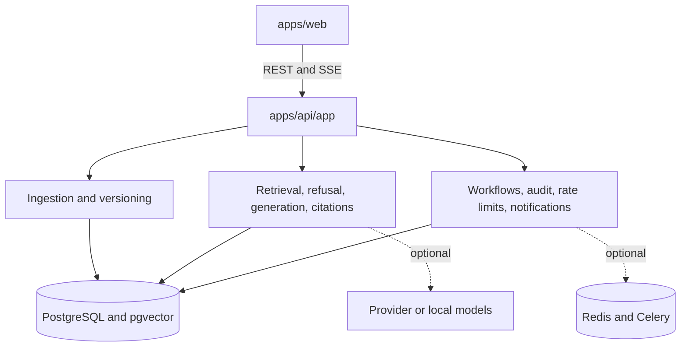

# GroundTruth Architecture

GroundTruth is a full-stack RAG platform: Next.js at the edge, FastAPI for application
and domain orchestration, and optional PostgreSQL/pgvector plus Redis/Celery for
persistent and asynchronous deployments. The default demo and unit-test paths use
deterministic local fallbacks and require none of those external services.

The application-owned compatibility layer at
`apps/api/app/internal/vendor_core/` supplies configuration, database helpers,
errors, logging, task setup, deterministic evaluation/embedding primitives, and
pricing/metrics support. It is a pinned, internally namespaced source copy—not an
external runtime dependency.

GroundTruth keeps its own SQLAlchemy declarative base and Alembic chain. Workspace
context is carried through requests, audit events, cost tracking, access checks,
document versions, and workflows. The product does not claim database-enforced row
level security or hosted multi-tenant administration.

See [docs/ARCHITECTURE.md](docs/ARCHITECTURE.md) for service boundaries and data flow,
and [docs/design-decisions.md](docs/design-decisions.md) for the compatibility and
golden-output decisions.
