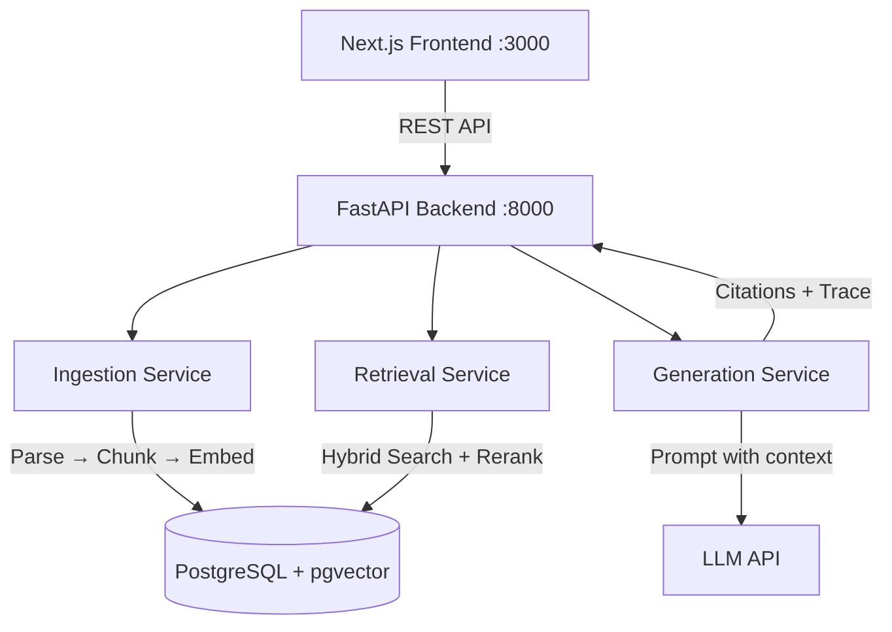

# GroundTruth

[]() []() []() []() []()

**Production RAG platform with hybrid search, citations, and refusal logic.**

GroundTruth answers questions only from uploaded documents, always cites sources, refuses when evidence is insufficient, and exposes full retrieval traces for debugging.

[Quick Demo](#quick-demo) • [Architecture](#architecture) • [API Docs](docs/API.md)

---

## Quick Demo

```bash
make demo
```

Starts all services, seeds sample data, and opens the UI at http://localhost:3000

---

## 1. What This Is

GroundTruth is an open-source internal assistant template that answers questions **only** from uploaded documents, always **cites sources**, **refuses when evidence is insufficient**, and exposes **retrieval/debug traces**.

It is NOT "chat with your PDFs." It is a production-minded RAG system with evidence discipline — designed for teams that need trustworthy, auditable AI-assisted answers grounded in their own documentation.

---

## 2. What Problem It Solves

Teams deploying internal AI assistants face a common set of failures:

- **Hallucinated answers** that sound confident but are fabricated
- **No source attribution** — users cannot verify where information came from
- **No graceful refusal** — the system tries to answer every question, even when it shouldn't
- **No debuggability** — when answers are wrong, there's no way to trace what was retrieved

GroundTruth addresses all four. Every answer is grounded in retrieved evidence, every claim is cited, and when evidence is insufficient the system says so explicitly. Retrieval traces are exposed so teams can debug and improve their document corpus.

---

## 3. Why Naive AI Systems Fail Here

| Failure Mode | Naive System | GroundTruth |
|---|---|---|
| Hallucination | LLM generates plausible-sounding fiction | LLM is constrained to retrieved context only |
| No Citations | Users must trust answers blindly | Every factual claim links to source chunks |
| No Refusal | System answers everything, even garbage | Confidence thresholds trigger graceful refusal |
| No Debuggability | Black box | Full retrieval trace with scores and ranking |

---

## 4. Architecture



---

## 5. Local Quickstart

```bash
# Clone and enter the project
git clone https://github.com/your-org/groundtruth.git
cd groundtruth

# Copy environment variables
cp .env.example .env

# Start all services
docker compose up --build

# Access the application
# Frontend UI: http://localhost:3000
# Backend API: http://localhost:8000
# API Docs:    http://localhost:8000/docs
```

Upload sample documents from `data/sample/` and start asking questions.

---

## 6. Example Workflow

1. **Upload** — Drag and drop your team's documents (PDF, Markdown, HTML, DOCX) via the UI
2. **Process** — Documents are parsed, chunked, embedded, and stored with full metadata
3. **Ask** — Type a natural language question in the chat interface
4. **Retrieve** — The system performs hybrid search (vector + keyword), reranks results, and checks confidence
5. **Answer** — The LLM generates a grounded answer using only retrieved context
6. **Cite** — Every factual claim is linked to source chunks with relevance scores
7. **Trace** — Expand the retrieval trace to see exactly which chunks were found, their scores, and how they were ranked

If confidence is low, the system refuses with a clear explanation and suggestion for reformulation.

---

## 7. Key Design Decisions

| Decision | Rationale |
|---|---|
| **Hybrid search** (vector + keyword) | Pure vector search misses exact matches; pure keyword misses semantic similarity |
| **Reranking** | Initial retrieval cast a wide net; reranking narrows to truly relevant results |
| **Refusal logic** | Better to say "I don't know" than to hallucinate; builds user trust |
| **Citation assembly** | Every claim must be traceable to a source chunk; enables verification |
| **pgvector** | Keeps vector storage co-located with relational data; simplifies deployment |
| **Service boundaries** | Each pipeline stage (ingestion, retrieval, generation) is isolated for testability |

---

## 8. Failure Handling

| Scenario | Behavior |
|---|---|
| No documents found | Return refusal: "I don't have any documents matching that topic" |
| Low confidence (< threshold) | Return refusal with confidence score and suggestion |
| LLM API error | Return error response with retry suggestion |
| Document processing failure | Mark document as `error` status, log details |
| Empty or malformed query | Return 422 validation error |

---

## 9. Evaluation & Testing Strategy

GroundTruth is designed for eval-driven iteration:

- **Unit tests** for each service (chunking, embedding, retrieval, citation, refusal)
- **Integration tests** for full pipeline (upload → query → answer)
- **Retrieval traces** exposed via API for manual inspection
- **EvalForge integration** planned for automated evaluation of answer quality, citation accuracy, and refusal appropriateness

---

## 10. Deployment Notes

- **Docker Compose** for local development and single-server deployment
- **Environment variables** for all configuration (see `.env.example`)
- **Scaling**: Stateless API servers behind a load balancer; PostgreSQL with read replicas for retrieval
- **Monitoring**: Health check endpoint at `/api/health`; structured logging throughout
- **Security**: API key for LLM access; document-level access control planned

---

## 11. Roadmap

- [ ] Multi-tenant support with workspace isolation
- [ ] Additional parsers (CSV, XLSX, PPTX)
- [ ] Conversation memory with context windowing
- [ ] Streaming responses via Server-Sent Events
- [ ] Cost tracking per query
- [ ] EvalForge integration for automated evaluation
- [ ] Admin dashboard for document management
- [ ] Webhook notifications for processing events

---

## 12. What This Project Demonstrates

Production-minded RAG design, service boundaries, retrieval observability, source citation, refusal behavior, and eval-driven iteration.
