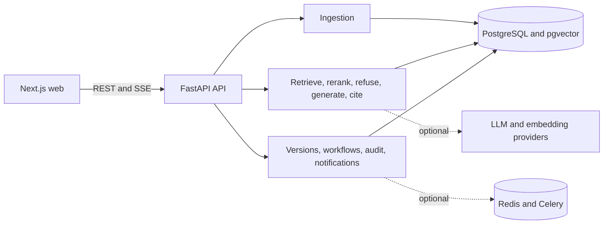

# GroundTruth

[](https://github.com/FishRaposo/groundtruth/actions/workflows/ci.yml)
[](apps/api/pyproject.toml)

**A production-minded RAG platform with hybrid retrieval, citations, refusal logic,
and deterministic offline fallbacks.**

GroundTruth answers from uploaded evidence, exposes retrieval traces, and refuses
when evidence is insufficient. It includes a FastAPI API, a Next.js interface,
PostgreSQL/pgvector integration, Redis/Celery workflows, document versioning,
workspace-aware audit and rate-limit controls, and local notification adapters.

[Offline demo](#offline-demo) · [Setup](SETUP.md) · [Architecture](docs/ARCHITECTURE.md) · [API](docs/API.md) · [Testing](docs/TESTING.md)

## Offline demo

The fastest proof path needs no credentials, database, Redis, model download, or
sibling repository:

```bash
python -m pip install -e "apps/api[dev]"
make demo
```

`make demo` runs the deterministic command-line grounded-answer and refusal demo.
It does not start Docker or open the web interface.

## Full-stack quickstart

```bash
cp .env.example .env
docker compose up --build
```

- Web: http://localhost:3000
- API: http://localhost:8000
- OpenAPI: http://localhost:8000/docs

The Compose stack starts PostgreSQL/pgvector, Redis, API, and web services. Provider
credentials remain optional because generation and embeddings have deterministic
offline fallbacks.

## What it does

1. **Ingests** TXT, PDF, Markdown, HTML, DOCX, CSV, and TSV by default. XLSX/PPTX,
   OCR, and model-backed embeddings/reranking are explicit extras.
2. **Normalizes and deduplicates** documents and chunks before embedding, retaining
   failed source files with quarantine metadata for reindexing.
3. **Retrieves** with vector and keyword search, reciprocal-rank fusion, and
   deterministic reranking fallbacks.
4. **Answers or refuses** using confidence and safety gates, with citations and a
   retrieval trace in normal and SSE flows.
5. **Tracks operations** with request/workspace context, structured audit events,
   cost attribution, API-key-aware rate limits, document version history, workflow
   status events, and a notification outbox.
6. **Supports local evaluation** through a dependency-free fixture adapter and a
   deterministic portfolio evidence bundle.

## Architecture


```mermaid
flowchart LR
    WEB[Next.js web] -->|REST and SSE| API[FastAPI API]
    API --> ING[Ingestion]
    API --> RAG[Retrieve, rerank, refuse, generate, cite]
    API --> WF[Versions, workflows, audit, notifications]
    ING --> DB[(PostgreSQL and pgvector)]
    RAG --> DB
    WF --> DB
    WF -. optional .-> REDIS[(Redis and Celery)]
    RAG -. optional .-> PROVIDER[LLM and embedding providers]
```

The API owns a narrow compatibility subset vendored at
`apps/api/app/internal/vendor_core/`. It is pinned to
`FishRaposo/operator-shared-core` v1.3.0 at commit
`dbf276a7708da65b55e1f10b35af634b300d1f07`, internally namespaced, MIT-licensed,
and shipped in the wheel. No external `shared_core` install, Git URL, or sibling
checkout is required. See [migration provenance](docs/migrations/2026-08-15-operator-shared-core-v1.3.0-vendoring.md).

## Verification

```bash
# Canonical installs
python -m pip install -e "apps/api[dev]"
cd apps/web && npm ci && cd ../..

# Complete local gate; Playwright Chromium must already be installed
make check

# Install the browser once when needed
cd apps/web && npx playwright install chromium
```

The gate covers API pytest, Ruff lint and format checks, Pyright, the forbidden
external-dependency scan, wheel build/content/isolated-import verification,
deterministic portfolio evidence, frontend Vitest, ESLint, production build, and
desktop plus Pixel 5 Chromium Playwright smoke tests. The CI `workflow_dispatch`
`integration` input installs PostgreSQL and Redis extras before rerunning the
SQLite/offline integration-shaped contracts; it does not claim live-service coverage.

The final local pass recorded **290 passing API tests**, **47 passing frontend Vitest
tests across 12 files**, Ruff check/format, repository-wide Pyright with zero errors,
a production Next.js build, and **8/8** desktop plus Pixel 5 Chromium smoke tests.
The evidence bundle reproduced byte-for-byte twice with hash
`daaa900b228aa7820ead848bdbf51ae3a6b723b514c24588f25f1f554741e334`.
Live PostgreSQL/Redis integration and Docker runtime execution were not available on
this host and are not implied pass claims.

## Security and deployment boundaries

- API authentication and rate limiting are configurable; rate buckets are isolated
  by workspace and hashed API-key identity.
- Uploaded filenames are not trusted for storage paths.
- SMTP, webhooks, OCR, Office parsing, local model inference, PostgreSQL, Redis, and
  Docker are opt-in integrations.
- SAML/SSO, hosted/team workflows, hosted notification services, mandatory
  infrastructure, cloud object storage, and hosted scheduling are deliberately
  deferred. See [Security](docs/SECURITY.md) and [Roadmap](ROADMAP.md).

## License and provenance

GroundTruth is MIT licensed. Third-party provenance and the vendored upstream license
are recorded in [THIRD_PARTY_NOTICES.md](THIRD_PARTY_NOTICES.md).
