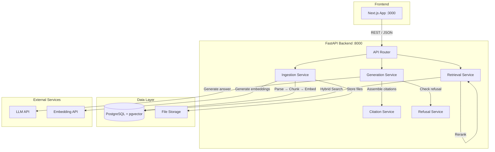
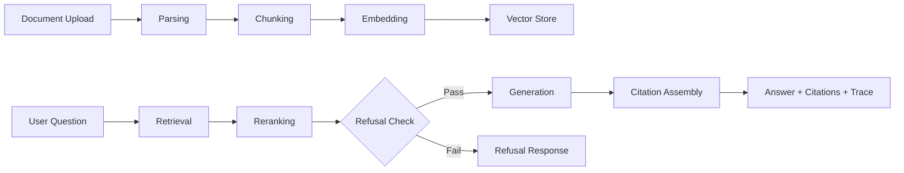

# Architecture

## System Overview

GroundTruth is a three-tier system: a Next.js frontend, a FastAPI backend, and a PostgreSQL database with the pgvector extension for vector storage.

## Data Flow

## Service Descriptions

| Service | Responsibility |
|---|---|
| **Ingestion** | Orchestrates document parsing, chunking, and embedding |
| **Parsing** | Extracts structured content from different file formats |
| **Chunking** | Splits documents into retrievable segments |
| **Embedding** | Converts text chunks into vector representations |
| **Retrieval** | Finds relevant chunks via hybrid search |
| **Reranking** | Re-scores retrieved chunks for relevance |
| **Generation** | Produces grounded answers from retrieved context |
| **Citation** | Assembles and validates source citations |
| **Refusal** | Determines whether sufficient evidence exists to answer |

## Technology Choices

| Choice | Technology | Rationale |
|---|---|---|
| Backend | FastAPI | Async support, automatic OpenAPI docs, Pydantic validation |
| Database | PostgreSQL + pgvector | Relational + vector in one system; mature, well-supported |
| Embeddings | OpenAI / sentence-transformers | Flexible: cloud or local; swap via config |
| LLM | OpenAI-compatible API | Broad model support via compatible endpoints |
| Frontend | Next.js + Tailwind | Fast SSR, component model, utility-first CSS |
| Migrations | Alembic | Standard for SQLAlchemy; version-controlled schema changes |
