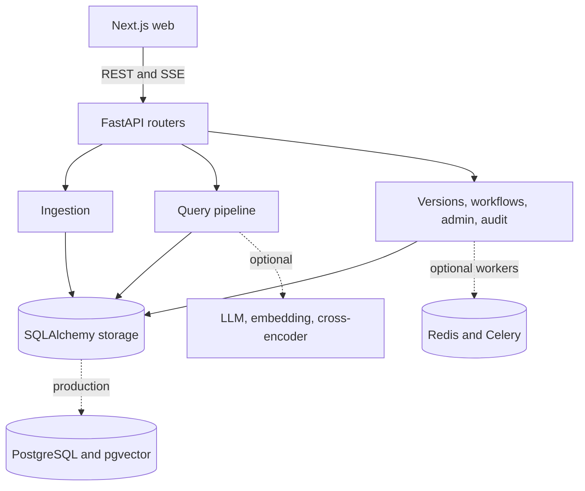
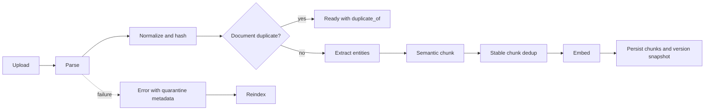

# Architecture

## System boundary

GroundTruth is one product with two application packages. `apps/web` is a Next.js
client. `apps/api` is a FastAPI package that owns the RAG domain, persistence models,
workflows, and operational controls. PostgreSQL/pgvector, Redis/Celery, provider APIs,
Office/OCR libraries, and local model weights are optional integrations.

```mermaid
flowchart TB
    WEB[Next.js web] -->|REST and SSE| API[FastAPI routers]
    API --> ING[Ingestion]
    API --> QUERY[Query pipeline]
    API --> OPS[Versions, workflows, admin, audit]
    ING --> STORE[(SQLAlchemy storage)]
    QUERY --> STORE
    OPS --> STORE
    STORE -. production .-> PG[(PostgreSQL and pgvector)]
    OPS -. optional workers .-> REDIS[(Redis and Celery)]
    QUERY -. optional .-> PROVIDERS[LLM, embedding, cross-encoder]
```

SQLite and deterministic provider fallbacks keep unit tests, the CLI demo, fixture
evaluation, and portfolio evidence credential-free.

## Ingestion

```mermaid
flowchart LR
    U[Upload] --> P[Parse]
    P --> N[Normalize and hash]
    N --> DD{Document duplicate?}
    DD -- yes --> READY[Ready with duplicate_of]
    DD -- no --> E[Extract entities]
    E --> C[Semantic chunk]
    C --> CD[Stable chunk dedup]
    CD --> EMB[Embed]
    EMB --> SAVE[Persist chunks and version snapshot]
    P -. failure .-> Q[Error with quarantine metadata]
    Q --> R[Reindex]
```

TXT/PDF/Markdown/HTML/DOCX/CSV/TSV adapters are in the ordinary install/test surface.
XLSX/PPTX, OCR, and model inference fail clearly when their extras are unavailable.
There is no parallel ingestion or quarantine service.

## Query

Vector and keyword retrieval feed reciprocal-rank fusion, reranking, confidence and
safety refusal, grounded generation, citation assembly, and retrieval tracing. The
provider interfaces return structured usage/provider/model/fallback metadata while
legacy response keys and SSE event vocabulary remain stable. Conversation memory is
disabled by default and becomes active only with a `conversation_id` and the `recent`
policy.

## Operational capabilities

- Request, workspace, and API-key context flows through logs, metrics, audit, cost,
  rate limiting, document versions, and workflows.
- Version restore creates a new immutable version rather than mutating history.
- Workflow definitions and instances are visibility-scoped; events can be observed
  through an additive local SSE status stream.
- Notifications pass through a redacted outbox. Memory/log are credential-free;
  SMTP and webhook delivery are opt-in adapters.
- Admin usage and audit endpoints are read-only evidence surfaces.

## Internal vendor-core compatibility layer

The pinned source subset in `app/internal/vendor_core/` supplies configuration,
database helpers, document parsing, deterministic embeddings/evaluation, errors,
logging, task setup, LLM metrics/pricing, and one HTTP client. Imports were rewritten
to the internal namespace. It ships in the GroundTruth wheel with the upstream MIT
license; there is no external `shared_core` package dependency.

GroundTruth deliberately retains its own declarative base, Alembic metadata, parser
registry, domain metrics (`groundtruth_*`), retrieval score formulae, refusal rules,
citation assembly, and SSE contract. See [design-decisions.md](design-decisions.md) and
[the vendoring provenance](migrations/2026-08-15-operator-shared-core-v1.3.0-vendoring.md).

## Deliberate boundaries

SAML/SSO, hosted/team workflows, hosted notification services, mandatory external
infrastructure, cloud object storage, and hosted scheduling are not implemented.
Workspace scoping is an application contract; this repository does not claim
database row-level security or a hosted tenancy control plane.
