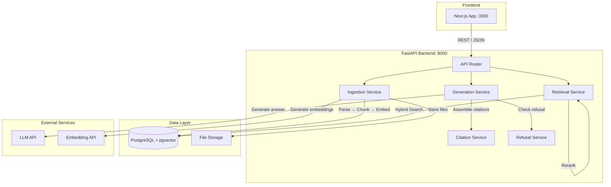
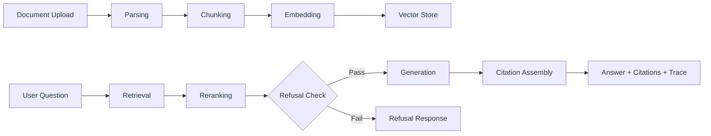
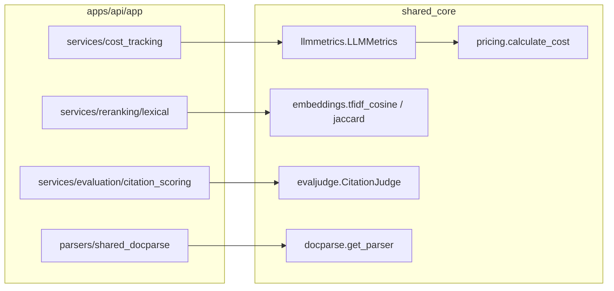
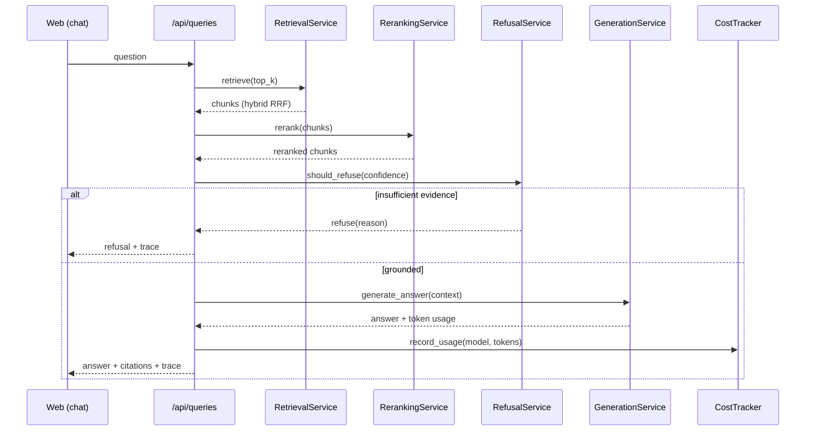

# Architecture

## System Overview

GroundTruth is a three-tier system: a Next.js frontend, a FastAPI backend, and a PostgreSQL database with the pgvector extension for vector storage.

```mermaid
graph TB
    subgraph Frontend
        UI[Next.js App :3000]
    end

    subgraph Backend [FastAPI Backend :8000]
        API[API Router]
        IS[Ingestion Service]
        RS[Retrieval Service]
        GS[Generation Service]
        CS[Citation Service]
        RF[Refusal Service]
    end

    subgraph Data [Data Layer]
        DB[(PostgreSQL + pgvector)]
        FS[File Storage]
    end

    subgraph External [External Services]
        LLM[LLM API]
        EM[Embedding API]
    end

    UI -->|REST / JSON| API
    API --> IS
    API --> RS
    API --> GS
    IS -->|Parse → Chunk → Embed| DB
    IS -->|Store files| FS
    IS -->|Generate embeddings| EM
    RS -->|Hybrid Search| DB
    RS -->|Rerank| RS
    GS -->|Generate answer| LLM
    GS -->|Assemble citations| CS
    GS -->|Check refusal| RF
```

## Data Flow

```mermaid
flowchart LR
    Upload[Document Upload] --> Parse[Parsing]
    Parse --> Chunk[Chunking]
    Chunk --> Embed[Embedding]
    Embed --> Store[Vector Store]

    Query[User Question] --> Retrieve[Retrieval]
    Retrieve --> Rerank[Reranking]
    Rerank --> Refuse{Refusal Check}
    Refuse -->|Pass| Generate[Generation]
    Refuse -->|Fail| Refusal[Refusal Response]
    Generate --> Cite[Citation Assembly]
    Cite --> Response[Answer + Citations + Trace]
```

## Service Descriptions

| Service | Responsibility |
|---|---|
| **Ingestion** | Orchestrates document parsing, chunking, and embedding |
| **Parsing** | Extracts structured content from different file formats |
| **Chunking** | Splits documents into retrievable segments |
| **Embedding** | Converts text chunks into vector representations |
| **Retrieval** | Finds relevant chunks via hybrid search |
| **Reranking** | Re-scores retrieved chunks for relevance |
| **Generation** | Produces grounded answers from retrieved context |
| **Citation** | Assembles and validates source citations |
| **Refusal** | Determines whether sufficient evidence exists to answer |

## Technology Choices

| Choice | Technology | Rationale |
|---|---|---|
| Backend | FastAPI | Async support, automatic OpenAPI docs, Pydantic validation |
| Database | PostgreSQL + pgvector | Relational + vector in one system; mature, well-supported |
| Embeddings | OpenAI / sentence-transformers | Flexible: cloud or local; swap via config |
| LLM | OpenAI-compatible API | Broad model support via compatible endpoints |
| Frontend | Next.js + Tailwind | Fast SSR, component model, utility-first CSS |
| Migrations | Alembic | Standard for SQLAlchemy; version-controlled schema changes |

## Shared-core layer

GroundTruth runs on the workspace-wide `shared_core` standard. Infrastructure
(config, logging, errors, DB engine, Celery) comes from `shared_core`; the RAG
domain is preserved. Several **domain capabilities** also converge onto
`shared_core` primitives, added alongside the working internals rather than
replacing them:

```mermaid
graph LR
    subgraph app[apps/api/app]
        CT[services/cost_tracking]
        LR[services/reranking/lexical]
        CE[services/evaluation/citation_scoring]
        SD[parsers/shared_docparse]
    end
    subgraph sc[shared_core]
        LM[llmmetrics.LLMMetrics]
        EMB[embeddings.tfidf_cosine / jaccard]
        EJ[evaljudge.CitationJudge]
        DP[docparse.get_parser]
        PR[pricing.calculate_cost]
    end
    CT --> LM --> PR
    LR --> EMB
    CE --> EJ
    SD --> DP
```

| Capability | Module | shared_core primitive |
|---|---|---|
| Per-workspace cost/latency tracking | `services/cost_tracking.py` | `llmmetrics.LLMMetrics` (+ `pricing`) |
| Offline lexical reranking pass | `services/reranking/lexical.py` | `embeddings.tfidf_cosine`, `jaccard_similarity` |
| Citation grounding evaluation | `services/evaluation/citation_scoring.py` | `evaljudge.CitationJudge` |
| Bytes-based parsing adapter | `parsers/shared_docparse.py` | `docparse.get_parser` |

These are **additive**: the existing file-path parsers, heuristic reranker, and
in-house cosine similarity remain the defaults so no numeric output changed. See
[design-decisions.md](./design-decisions.md) for the golden-output gating rationale.

## Query pipeline (sequence)

```mermaid
sequenceDiagram
    participant W as Web (chat)
    participant Q as /api/queries
    participant R as RetrievalService
    participant K as RerankingService
    participant F as RefusalService
    participant G as GenerationService
    participant C as CostTracker

    W->>Q: question
    Q->>R: retrieve(top_k)
    R-->>Q: chunks (hybrid RRF)
    Q->>K: rerank(chunks)
    K-->>Q: reranked chunks
    Q->>F: should_refuse(confidence)
    alt insufficient evidence
        F-->>Q: refuse(reason)
        Q-->>W: refusal + trace
    else grounded
        Q->>G: generate_answer(context)
        G-->>Q: answer + token usage
        Q->>C: record_usage(model, tokens)
        Q-->>W: answer + citations + trace
    end
```

## Demo mode (frontend offline fallback)

The Next.js chat tries the real SSE endpoint first. When the *fetch itself*
fails (backend unreachable), it degrades to a self-contained offline demo —
showing a visible banner and replaying simulated, citation-grounded answers — so
the UI is explorable with zero backend. Application errors (e.g. a 404 from a
running server) are surfaced normally and never trigger demo mode. See
`apps/web/src/lib/demoMode.ts`.
