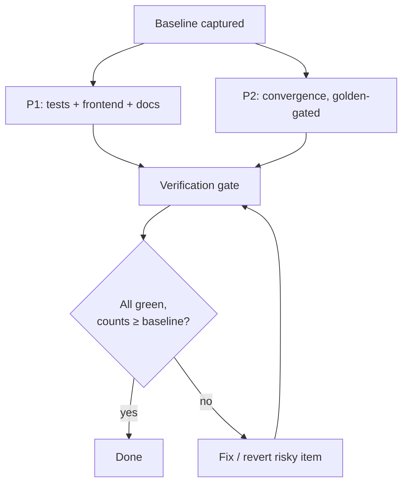

# Execution Plan

This document records how GroundTruth was raised to the comprehensive bar without
regressing its already-passing suite, and the order in which the work was done.

## Goals

1. **Do no harm.** The full existing suite (Python + TypeScript) must stay green, with
   the same or higher test count. `ruff check` + `ruff format --check` stay clean.
2. **Expand tests** to comprehensive coverage (success + error paths) for under-tested
   modules and any new code.
3. **Polish the frontend**: demo-mode fallback, loading/empty/error states, an
   `ErrorBoundary`, citation highlighting, more component tests, a Playwright smoke spec.
4. **Expand docs** to the comprehensive bar with Mermaid diagrams.
5. **Converge onto `shared_core`** for documented items — **golden-output-gated**: any
   change that would alter a numeric output is pinned by a test first, or skipped.

## Baseline (before any change)

| Surface | Result |
|---|---|
| `apps/api` pytest (unit) | **85 passed** |
| `apps/api` ruff check / format | clean |
| `apps/web` `tsc --noEmit` | clean |
| `apps/web` vitest | **8 passed** |
| `apps/web` `next build` | success |

## Workstreams

### Priority 1 — low-risk, must

- **API tests**: added suites for cost tracking, the lexical reranker, citation
  evaluation, the bytes-parser adapter, the heuristic reranking service, the generation
  service (offline + streaming), the cost-summary endpoint, and refusal edge cases.
- **Frontend polish**: `demoMode` library + visible demo banner and offline fallback in
  `ChatInterface`; `CitationText` for inline `[n]` highlighting (resolved vs. dangling);
  reused the existing `ErrorBoundary`, loading skeletons, and refusal/empty states.
- **Web tests**: `CitationText`, `ErrorBoundary`, `ChatInterface` (incl. demo-mode
  fallback), and `demoMode` lib suites; a Playwright `chat.spec.ts` smoke.
- **Docs**: expanded `architecture`, `design-decisions`, `failure-modes`, `roadmap`,
  `security` with Mermaid; added this execution plan; refreshed the README.

### Priority 2 — convergence (only where cleanly safe)

| Item | Decision | Why |
|---|---|---|
| Cost tracking → `shared_core.llmmetrics` | **Adopted** | New module + endpoint; no existing output touched |
| Reranking → `shared_core.embeddings` | **Adopted** (new `LexicalReranker`) | Added beside existing rerankers; pipeline default unchanged |
| Citation scoring → `shared_core.evaljudge.CitationJudge` | **Adopted** (new evaluator) | New surface; in-pipeline citation assembly unchanged |
| Document parsing → `shared_core.docparse` | **Adopted** (bytes adapter) | Complementary path; file parsers + golden tests intact |
| Retrieval `cosine_similarity` → `shared_core.embeddings` | **Skipped** | ~1-ULP float diff could flip a sort tie; golden-gated → deferred |
| Ingestion parser internals → `docparse` | **Skipped** | Different bytes API + `ParsedDocument` shape would change golden output |

See [design-decisions.md](./design-decisions.md) for the full rationale.

## Final state

| Surface | Result |
|---|---|
| `apps/api` pytest (unit) | **153 passed** (was 85) |
| `apps/api` ruff check / format | clean |
| `apps/web` `tsc --noEmit` | clean |
| `apps/web` vitest | **36 passed** (was 8) |
| `apps/web` `next build` | success |

No test was removed or weakened; every added capability is additive and test-gated.
