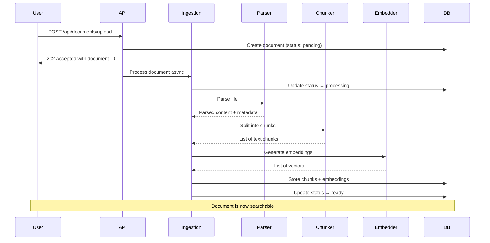

# Ingestion Flow

## Pipeline Overview

Documents move through a well-defined state machine during ingestion.



## Document States

| Status | Description |
|---|---|
| `pending` | Document uploaded, awaiting processing |
| `processing` | Currently being parsed, chunked, and embedded |
| `ready` | Fully processed and available for retrieval |
| `error` | Processing failed; error details in metadata |

## Metadata Schema

Each document stores the following metadata:

```json
{
  "title": "Company Handbook",
  "source_type": "pdf",
  "source_url": null,
  "content_hash": "sha256:abc123...",
  "file_size_bytes": 1048576,
  "page_count": 42,
  "chunk_count": 87,
  "processing_time_ms": 3200,
  "error": null,
  "custom": {}
}
```

## Chunking Configuration

| Parameter | Default | Description |
|---|---|---|
| `CHUNK_SIZE` | 512 | Target tokens per chunk |
| `CHUNK_OVERLAP` | 64 | Overlap tokens between adjacent chunks |
| `chunking_strategy` | `fixed` | Strategy: `fixed`, `semantic`, or `structural` |

## Embedding Configuration

| Parameter | Default | Description |
|---|---|---|
| `EMBEDDING_MODEL` | `text-embedding-3-small` | Model identifier |
| `EMBEDDING_DIMENSIONS` | 1536 | Vector dimensions |
| `batch_size` | 100 | Texts per embedding API call |
