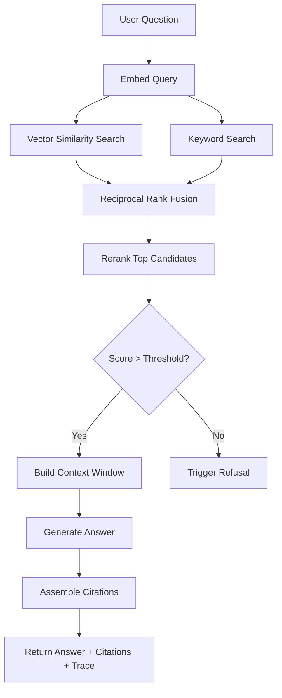

# Retrieval Flow

## Query Processing Pipeline



## Hybrid Search

GroundTruth uses **hybrid search** combining two complementary strategies:

### Vector Similarity Search
- Query is embedded using the same model as document chunks
- Cosine similarity between query embedding and stored vectors
- Captures semantic meaning even without exact keyword matches

### Keyword Search
- Full-text search using PostgreSQL `tsvector` / `tsquery`
- Captures exact term matches, abbreviations, and proper nouns
- Uses `ts_rank` for scoring

### Score Fusion (Reciprocal Rank Fusion)

```
RRF_score = Σ 1 / (k + rank_i)  where k = 60
```

Results from both search methods are merged using RRF, which is robust to different score scales and doesn't require normalization.

## Reranking

After initial retrieval, the top candidates are reranked:

1. **Input**: Query + top-K retrieved chunks (K typically 20)
2. **Scoring**: Cross-encoder model scores each (query, chunk) pair
3. **Output**: Re-ranked list with calibrated relevance scores
4. **Selection**: Top-N chunks passed to generation (N typically 5)

## Score Thresholds

| Threshold | Default | Purpose |
|---|---|---|
| `SIMILARITY_THRESHOLD` | 0.7 | Minimum similarity score for a chunk to be considered relevant |
| `REFUSAL_CONFIDENCE_THRESHOLD` | 0.5 | Minimum average confidence to proceed with answering |
| `RETRIEVAL_TOP_K` | 5 | Number of chunks to retrieve initially |

## Retrieval Trace

Every query records a full retrieval trace for debugging:

```json
{
  "query_embedding_dim": 1536,
  "vector_search_results": [
    {"chunk_id": "...", "score": 0.89, "document_title": "..."}
  ],
  "keyword_search_results": [
    {"chunk_id": "...", "score": 0.12, "document_title": "..."}
  ],
  "rrf_scores": [
    {"chunk_id": "...", "score": 0.031}
  ],
  "reranked_results": [
    {"chunk_id": "...", "score": 0.94, "rank": 1}
  ],
  "final_context_chunks": 5,
  "confidence": 0.82,
  "refused": false,
  "latency_ms": 340
}
```
