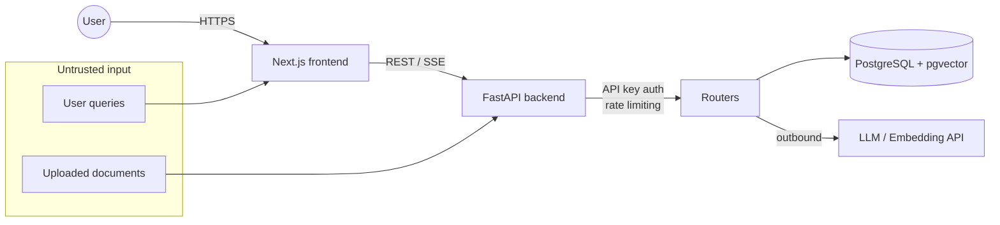

# Security Guide

## Trust boundaries



Untrusted inputs are user queries and uploaded document content. Both are treated
as adversarial: queries pass the refusal/safety gate, and document text is only
ever inserted into a **context-only** generation prompt (never executed).

## Threat model (RAG-specific)

| Threat | Vector | Control |
|---|---|---|
| Prompt injection | Malicious instructions inside an uploaded document or query | Safety/injection pattern screen in `services/refusal.py`; context-only system prompt; the LLM is instructed to answer *only* from context |
| Hallucinated / ungrounded answers | LLM invents facts beyond the evidence | Grounded refusal on low confidence; `[n]` citation markers; `CitationEvaluator` flags dangling markers |
| Data exfiltration via citations | Citation preview leaks unrelated content | Citations are assembled only from chunks retrieved for *this* query |
| Cost abuse / runaway spend | Expensive or looping LLM calls | Per-workspace cost/latency tracking (`/api/metrics/cost`); rate limiting |
| Unauthenticated access | Direct API calls | API-key auth (`AUTH_ENABLED`) + rate limiting (`RATE_LIMIT_ENABLED`) |
| Injection via file type | Crafted file exploits a parser | Parsers extract text only; `ALLOWED_FILE_TYPES` and `MAX_FILE_SIZE_MB` bound input |

## Rate Limiting

Rate limiting is enforced by `RateLimitMiddleware` (`app/middleware/rate_limit.py`)
when `RATE_LIMIT_ENABLED` is set (and outside `APP_ENV=testing`).

**Limitation — limits are IP-based, not per-API-key.** The middleware is a
Starlette `BaseHTTPMiddleware` and runs *before* the `ApiKeyAuth` route
dependency executes, so `request.state.api_key` is not yet populated during
`dispatch`. As a result every request is keyed by client IP and bounded by the
static `default_rate_limit`; the per-key `rate_limit` column on `ApiKey` is
**not** currently honored. The code in `_get_key_identifier` /
`_get_rate_limit` falls back to IP + default for this reason.

To enforce true per-key limits the middleware would need to resolve the
`X-API-Key` header (hash + DB lookup) itself rather than relying on the
downstream dependency. This is tracked as a known gap.

## Secrets Management

### Environment Variables

All secrets are loaded from environment variables. Never commit secrets to git.

```bash
# Copy the example file
cp .env.example .env

# Edit with your actual secrets
nano .env
```

### Required Secrets

| Variable | Purpose | Example |
|----------|---------|---------|
| `OPENAI_API_KEY` | LLM API access | `sk-...` |
| `DATABASE_PASSWORD` | Database access | `your-secure-password` |
| `API_KEY` | Internal API authentication | `gt-...` |

### Secret Rotation

1. Generate new secret
2. Update `.env` file
3. Restart services: `make dev-down && make dev`
4. Remove old secret from provider dashboard

### Production Deployment

Use a secrets manager:
- AWS: AWS Secrets Manager or Parameter Store
- GCP: Secret Manager
- Azure: Key Vault
- Kubernetes: Sealed Secrets or External Secrets Operator

## Security Checklist

- [ ] `.env` in `.gitignore`
- [ ] No hardcoded secrets in source code
- [ ] Database uses strong password
- [ ] API keys rotated every 90 days
- [ ] HTTPS only in production
- [ ] Rate limiting enabled

## Reporting Vulnerabilities

Contact: security@your-org.com
