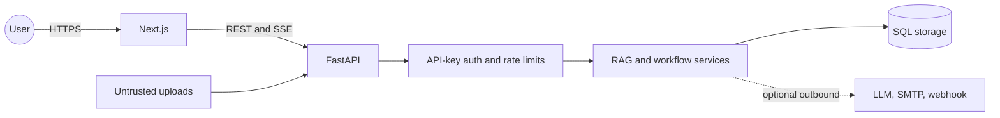

# Security

## Trust boundaries

Queries, headers, API keys, filenames, document contents, provider responses, and
notification payloads cross trust boundaries. GroundTruth uses validation, bounded
inputs, context-only prompting, refusal/citation gates, redaction, and opt-in outbound
adapters; it is not a substitute for deployment-layer HTTPS, network policy, backups,
or a secrets manager.

## Implemented controls

- API-key authentication is configurable. Raw keys are not retained for rate-limit
  identity and plaintext key material is returned only on creation.
- Fixed-window rate-limit buckets are isolated by `X-Workspace-ID` plus authenticated
  API-key ID, hashed `X-API-Key`, or client IP fallback. Responses include standard
  limit/remaining/reset headers and 429 `Retry-After`.
- Request/workspace context flows into structured logs, metrics, cost attribution,
  access predicates, and redacted audit events.
- Uploaded filenames are never trusted for path construction; storage names derive
  from document UUIDs plus validated extensions and real-path containment checks.
- Refusal and citation checks reduce ungrounded-answer risk. Retrieved document text
  is context, not executable instruction.
- Notification outbox metadata is redacted. In-memory/log sinks are the default;
  SMTP/webhook delivery is constructed only when explicitly configured.
- Document versions are immutable snapshots; restore creates a new version.

## Limitations

- Rate-limit buckets are process-local and fixed-window. Multiple API replicas need a
  shared limiter before this can be treated as a global quota.
- Workspace scoping is enforced in application queries and context. Database row-level
  security and a hosted tenant control plane are not claimed.
- Prompt-injection screening and citations reduce risk but do not prove that model
  output is safe or complete.
- The local webhook adapter is a basic outbound JSON client; production deployments
  should add destination allowlists, signing, retry policy, and network egress rules.
- The Compose files are examples, not hardened hosted infrastructure.

## Secrets

No credential is required for the offline demo or default unit/CI gates. For optional
integrations, provide secrets through the deployment environment and never commit
`.env`:

- `OPENAI_API_KEY` for provider-backed generation/embeddings.
- database credentials for PostgreSQL deployments.
- SMTP/webhook settings when those sinks are intentionally enabled.

Use a deployment-appropriate secrets manager, rotate credentials after exposure, and
keep production access logs free of raw keys or sensitive document content.

## Deferred security/identity surface

SAML/SSO, hosted/team administration, hosted notifications, mandatory infrastructure,
cloud object storage, and hosted scheduling are deliberately deferred. Do not infer
those controls from workspace-aware application code.

## Reporting

Use the repository's private security-reporting channel. This document intentionally
does not publish an unverified placeholder email address.
