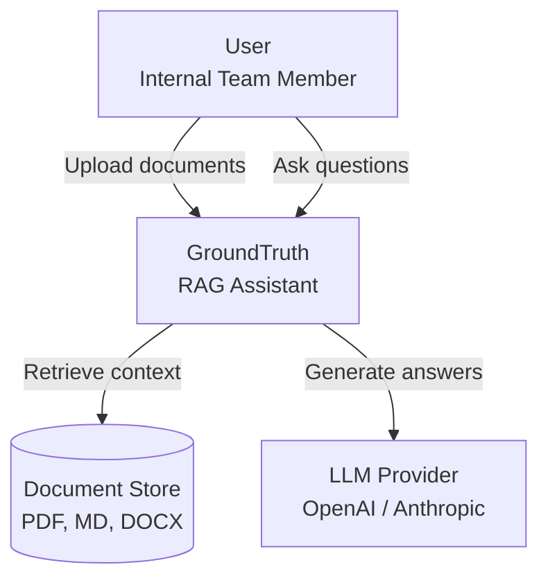
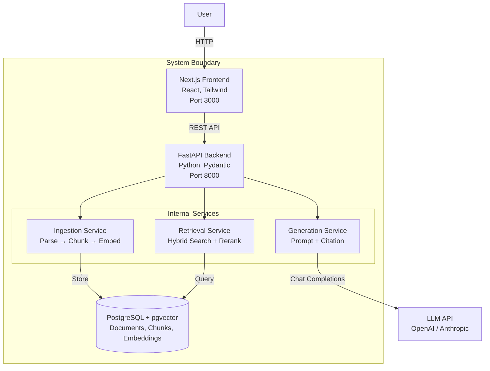
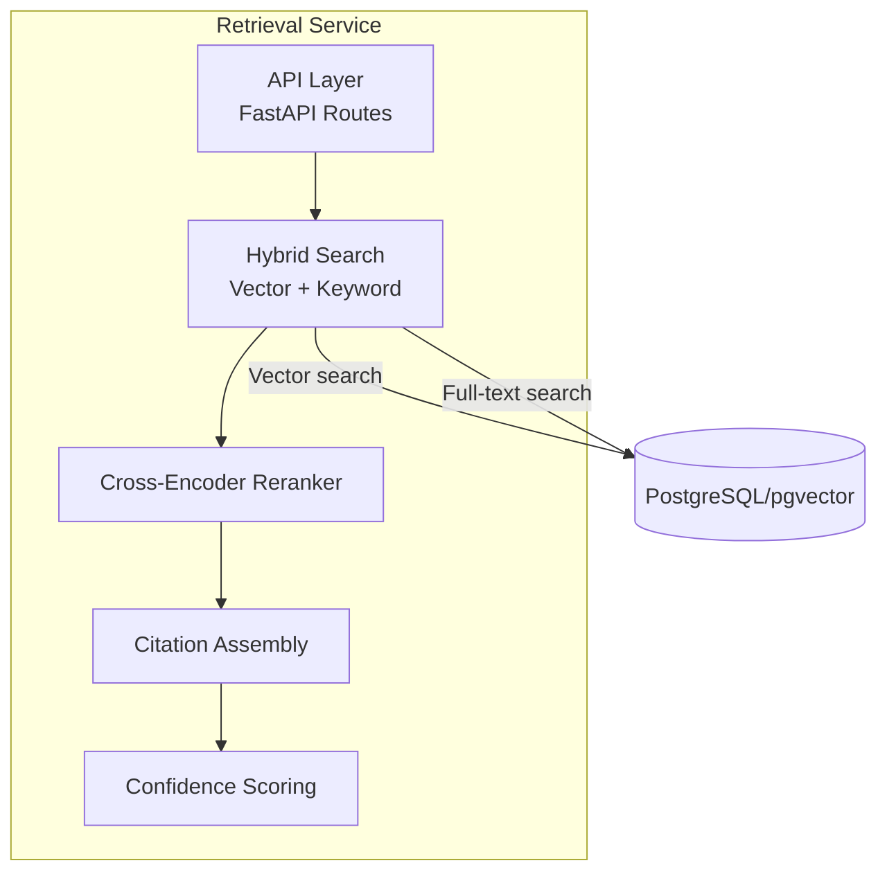
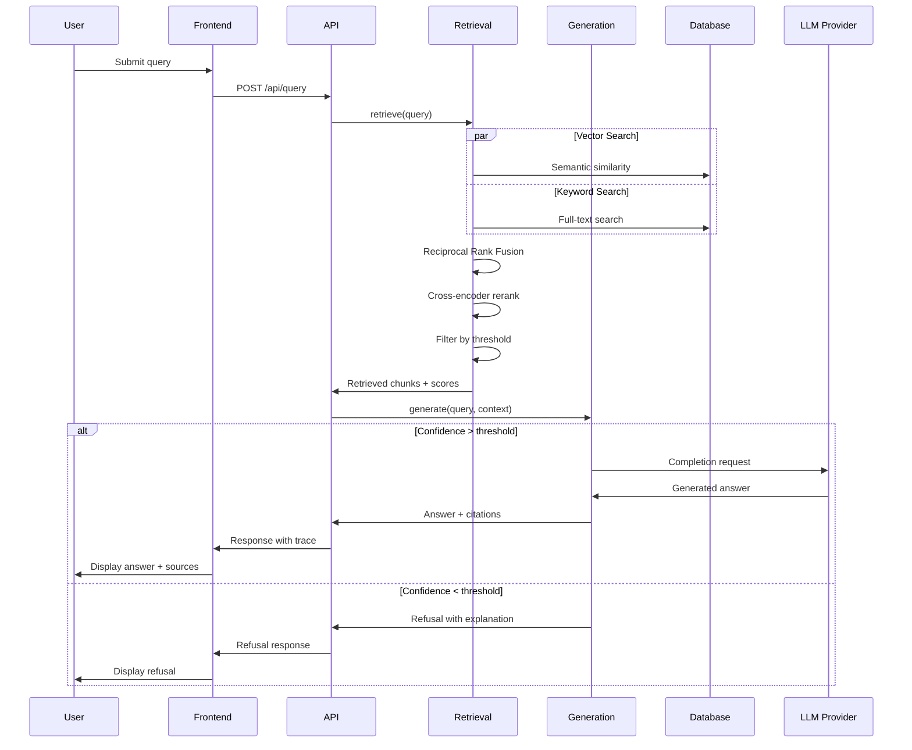

# GroundTruth Architecture (C4 Model)

## Context Diagram (C4 Level 1)

## Container Diagram (C4 Level 2)

## Component Diagram (C4 Level 3) - Retrieval Service

## Data Flow - Query Processing

## Key Architectural Decisions

| Decision | Rationale |
|----------|-----------|
| **Hybrid Search** | Combines semantic similarity (vector) with exact matching (keyword) for better recall |
| **Reranking** | Initial retrieval casts wide net; reranking with cross-encoder improves precision |
| **Citation Assembly** | Every claim traceable to source chunks enables verification and debugging |
| **Refusal Logic** | Better to say "I don't know" than hallucinate; maintains user trust |
| **Service Boundaries** | Each pipeline stage isolated for independent testing and scaling |
| **pgvector** | Co-located vector and relational storage simplifies deployment |

## Technology Stack

| Layer | Technology |
|-------|------------|
| Frontend | Next.js 14, React, TypeScript, Tailwind CSS |
| Backend | FastAPI, Pydantic, SQLAlchemy |
| Database | PostgreSQL 16, pgvector extension |
| Embeddings | OpenAI text-embedding-3-small |
| LLM | OpenAI GPT-4o / GPT-4o-mini |
| Deployment | Docker Compose |

## Scalability Considerations

- **Horizontal**: Stateless API servers behind load balancer
- **Database**: Read replicas for retrieval queries
- **Caching**: Redis for embedding cache (future)
- **Async**: Celery for document processing (future)
