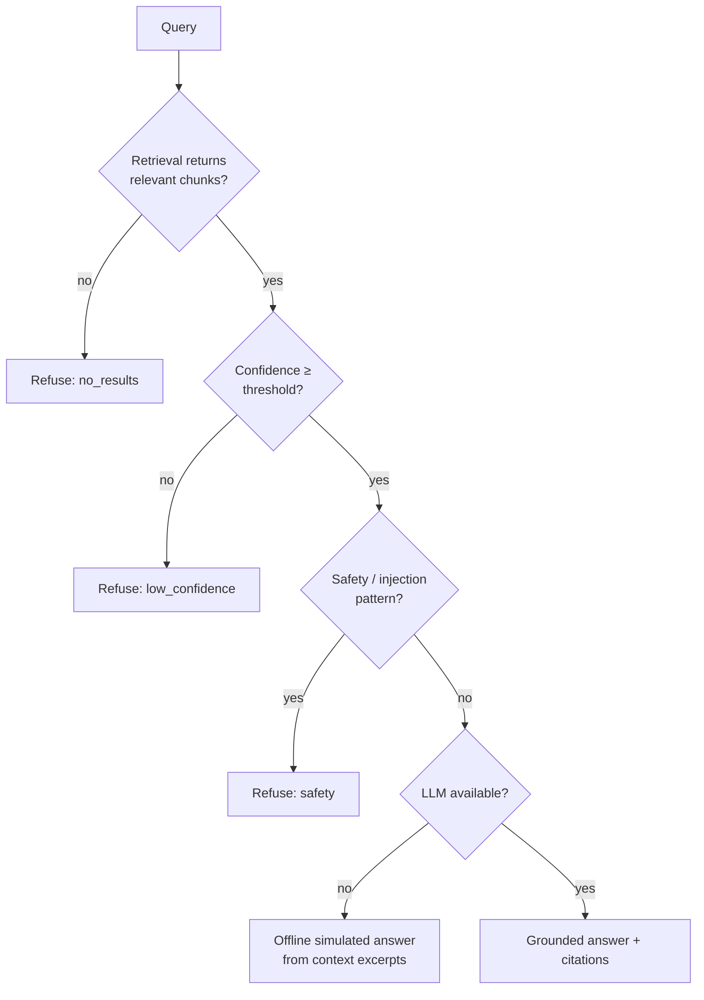

# Failure Modes

This catalogs how GroundTruth degrades under each fault. The guiding principle:
**fail closed toward a grounded refusal or an honest error, never toward a
confident hallucination.**

## Insufficient evidence → refusal
- **Cause:** retrieval returns no chunk above the confidence/similarity threshold.
- **Detection:** the refusal engine (`services/refusal.py`) compares the top score against
  `REFUSAL_CONFIDENCE_THRESHOLD` / `SIMILARITY_THRESHOLD`.
- **Mitigation:** the system **refuses with a message** rather than hallucinating an
  ungrounded answer. This is a feature, not a bug — the offline demo shows it.

## Database / pgvector unavailable
- **Cause:** PostgreSQL down, or the `vector` extension missing.
- **Detection:** `/api/health/ready` probes the DB, the pgvector extension, and embeddings.
- **Mitigation:** readiness reports `degraded`; offline mode falls back to in-memory paths.
- **Future fix:** automatic reconnection/backoff.

## Embedding backend unavailable
- **Cause:** no OpenAI key and `sentence-transformers` not installed.
- **Detection:** the embedding service catches provider errors.
- **Mitigation:** deterministic offline hash-embedding fallback keeps retrieval working
  (the unit test suite relies on this — no API key or torch needed).

## LLM generation failure
- **Cause:** OpenAI/gateway error during answer generation.
- **Mitigation:** generation returns the retrieved context excerpts instead of failing,
  and still records cost/latency.

## Prompt injection via retrieved text
- **Cause:** malicious content in an ingested document.
- **Mitigation:** the refusal/safety gates screen for injection patterns; generation is
  constrained to a context-only system prompt. See [SECURITY.md](./SECURITY.md).

## Backend unreachable from the frontend
- **Cause:** the API is down or the static frontend is opened with no server.
- **Detection:** the chat's streaming `fetch` throws a network error (`TypeError` /
  "failed to fetch"), distinguished from application errors by `isNetworkError`.
- **Mitigation:** the UI switches to **demo mode** — a visible banner plus simulated,
  citation-grounded answers — so the product stays explorable. Covered by the
  `ChatInterface` and `demoMode` vitest suites and the Playwright `chat.spec.ts` smoke.

## Dangling citation markers in an answer
- **Cause:** the LLM emits a `[n]` marker with no corresponding retrieved source.
- **Detection:** `CitationEvaluator` (over `shared_core.evaljudge.CitationJudge`) reports
  `dangling_markers`; the frontend `CitationText` renders unresolved markers muted.
- **Mitigation:** readers can visually distinguish grounded from ungrounded claims;
  `validate_citations` can reject answers whose markers are not all resolved.

## Cost/latency blind spots
- **Cause:** unattributed LLM spend across workspaces.
- **Mitigation:** `CostTracker` (over `shared_core.llmmetrics`) accumulates per-workspace
  token/cost/latency/error aggregates, exposed read-only at `GET /api/metrics/cost`.
