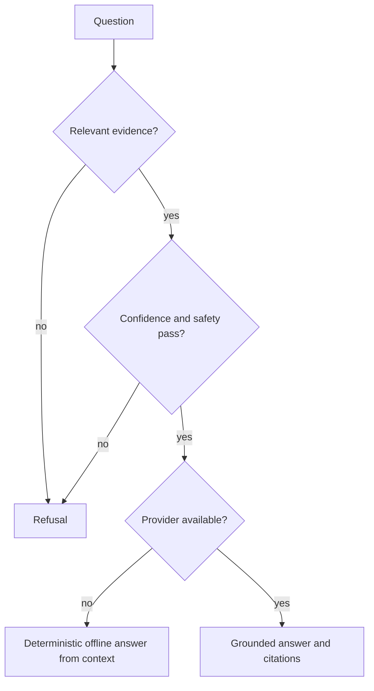

# Failure modes

GroundTruth should fail toward a grounded refusal or an explicit error, never toward
a confident unsupported answer.

## Query and model failures

- **No or low-confidence evidence:** refusal engine returns the established reason and
  trace rather than asking generation to invent an answer.
- **Provider unavailable:** typed adapters report fallback metadata and the legacy
  service returns deterministic context-based output. A provider error does not relax
  citation/refusal rules.
- **Missing cross-encoder/model files:** the opt-in reranker opens local files only and
  falls back to deterministic lexical Jaccard scoring.
- **Dangling citation marker:** the internally vendored deterministic citation judge
  reports the marker; the UI renders unresolved citations as muted rather than
  pretending they resolve.
- **Backend unreachable from web:** network failures enter visibly labeled demo mode.
  Application errors from a reachable API remain errors and do not trigger simulation.

## Ingestion failures

- **Unsupported extension:** upload returns a clear client error.
- **Optional parser absent:** XLSX/PPTX/OCR paths return explicit missing-extra or 503
  behavior; default formats remain available.
- **Duplicate content/chunk:** normalized hashes keep the first canonical content and
  avoid duplicate embedding work while preserving audit history.
- **Parse/chunk/embed failure:** document status becomes `error`; metadata records
  failing stage, reason, and retained UUID-safe source path. Retry uses reindex rather
  than a second quarantine pipeline.

## Persistence and workflow failures

- **PostgreSQL/pgvector unavailable:** readiness reports degraded. Default unit/demo
  paths can use SQLite/in-memory behavior, but persistent production operations do not
  silently claim success.
- **Redis/Celery unavailable:** optional asynchronous worker execution is unavailable;
  this is not a failure of the credential-free unit/demo path.
- **Missing version:** diff/restore returns 404; restore never rewrites immutable
  history.
- **Workflow visibility mismatch:** application predicates hide cross-workspace or
  non-owned instances.
- **Notification destination unavailable:** local memory/log sinks remain available;
  optional SMTP/webhook delivery errors must be surfaced by the configured deployment.

## Verification failures

- **External shared-core dependency returns:** the forbidden scan fails.
- **Vendored files omitted from wheel:** wheel-content or isolated-import verification
  fails.
- **Evidence drift:** checksum/evidence verification fails instead of rewriting the
  golden artifact in CI.
- **Optional integration unavailable:** ordinary CI remains green only if default
  offline gates pass; PostgreSQL/Redis integration results are reported separately and
  never implied by unit-test success.
